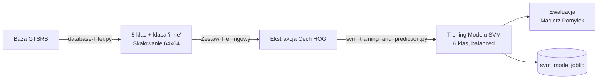
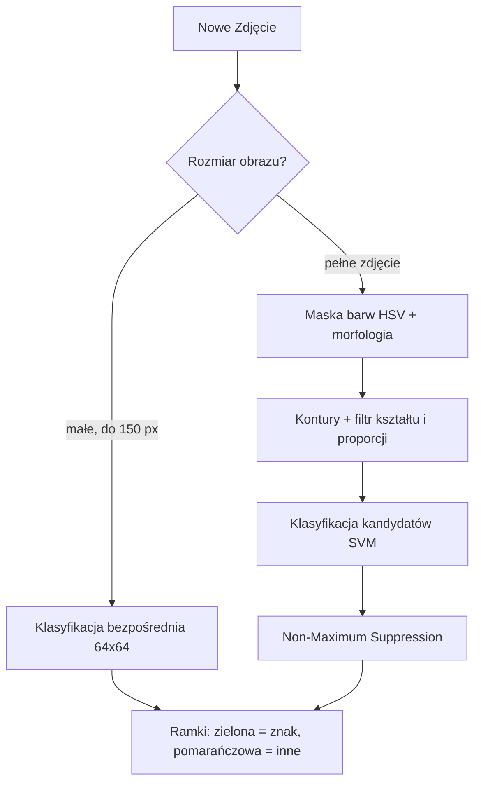

<div align="center">
  
# System Wizyjny: Detekcja i Klasyfikacja Znaków Drogowych

[](https://www.python.org)
[](https://opencv.org)
[](https://scikit-learn.org/)

**Politechnika Rzeszowska im. Ignacego Łukasiewicza (PRz)**  
Projekt zaliczeniowy z przedmiotu **Wizja Komputerowa**

</div>

---

## Zespół Projektowy

| Imię i Nazwisko | Rola w projekcie |
| :--- | :--- |
| **Jakub Jaszcz** | Architektura, Klasyfikacja SVM, GUI |
| **Karol Malinowski** | Ekstrakcja cech (HOG), Ewaluacja modelu |
| **Jakub Śliwa** | Segmentacja MSER, Przetwarzanie obrazu |
| **Filip Konfederak** | Detekcja krawędzi (Canny), Analiza HSV |
| **Krystian Nowak** | Baza danych, Skrypty filtrujące, Testy |

---

## Krótki opis projektu
Projekt realizuje system wizyjny do detekcji oraz klasyfikacji znaków drogowych w oparciu o klasyczne metody wizji komputerowej i uczenie maszynowe. Wykorzystuje bazę GTSRB (German Traffic Sign Recognition Benchmark). System rozpoznaje **5 docelowych klas znaków** oraz posiada dodatkowo **klasę odrzucenia „inne"** (zbudowaną z pozostałych klas GTSRB), dzięki czemu potrafi odrzucać znaki spoza zestawu zamiast wpychać je na siłę do jednej z 5 klas. Zaimplementowano segmentację po kolorze (HSV) i analizę kształtu konturów, ekstrakcję cech HOG oraz klasyfikację liniowym SVM. Wyniki porównano z pretrenowanym detektorem YOLOv8n. Projekt zawiera graficzną aplikację desktopową (GUI) do testowania modelu.

### Obsługiwane klasy
| ID | Znak |
|----|------|
| 2  | Ograniczenie prędkości (50 km/h) |
| 12 | Droga z pierwszeństwem |
| 14 | Znak STOP |
| 17 | Zakaz wjazdu |
| 35 | Nakaz jazdy prosto |
| 0  | **inne** – klasa odrzucenia (znaki spoza zestawu) |

---

## Cel Projektu i Założenia

Celem projektu jest praktyczne zastosowanie klasycznych metod wizji komputerowej do rozwiązania rzeczywistego problemu: **autonomicznego rozpoznawania znaków drogowych z poziomu pojazdu**.

W przeciwieństwie do rozwiązań bazujących na głębokich sieciach neuronowych (Deep Learning), projekt ten polega na **klasycznych technikach przetwarzania obrazu** (Canny, MSER, przestrzenie barw) połączonych z tradycyjnym uczeniem maszynowym (SVM). Zapewnia to lekkość obliczeniową (brak konieczności użycia akceleratorów GPU) oraz wysoką interpretowalność uzyskiwanych wyników. Wyniki zestawiono następnie z pretrenowanym detektorem głębokim YOLOv8n.

---

## Architektura Systemu

System składa się z dwóch niezależnych potoków: przygotowania i treningu modelu oraz detekcji.

### 1. Potok Treningowy



### 2. Potok Detekcji (GUI)



---

## Wykorzystane Technologie

- **Język:** Python 3.8+
- **Przetwarzanie obrazu:** OpenCV, NumPy
- **Ekstrakcja cech:** HOG (Histogram of Oriented Gradients)
- **Uczenie maszynowe:** scikit-learn (Support Vector Machine z jądrem liniowym)
- **Sieć głęboka (porównanie):** Ultralytics YOLOv8n
- **GUI desktopowe:** Tkinter, Pillow
- **Wizualizacja danych:** Matplotlib, Seaborn

---

## Instrukcja Uruchomienia

### Instalacja

Pobierz repozytorium i zainstaluj niezbędne biblioteki (zalecane wirtualne środowisko `.venv`):

```bash
git clone https://github.com/xFluzr/detekcja_znakow_drogowych.git
cd detekcja_znakow_drogowych
pip install -r requirements.txt
```

> [!WARNING]
> Przed uruchomieniem skryptów upewnij się, że w głównym katalogu znajduje się rozpakowany folder `archive/` ze zbiorem **GTSRB** (pliki `Train.csv`, `Test.csv` oraz podkatalogi z obrazami, dostępne na [Kaggle](https://www.kaggle.com/datasets/meowmeowmeowmeowmeow/gtsrb-german-traffic-sign)).

### Krok 1: Wstępne przetwarzanie i filtracja bazy
Ekstrahuje z plików CSV 5 docelowych klas oraz buduje klasę „inne" (próbki z pozostałych klas GTSRB), skalując wszystko do 64×64 px.
```bash
python database-filter.py
```
*Tworzy folder `processed_data/` z danymi treningowymi i testowymi (foldery `0`, `2`, `12`, `14`, `17`, `35`).*

### Krok 2: Ekstrakcja cech i klasyfikacja (trening SVM)
Wczytuje przetworzone zdjęcia, oblicza wektory HOG, trenuje model SVM (6 klas, `class_weight='balanced'`), testuje go na zbiorze testowym i zapisuje pomyłki. Generuje `svm_model.joblib`, `macierz_pomylek.png` i `bledy_modelu.png`.
```bash
python svm_training_and_prediction.py
```
*Błędnie sklasyfikowane znaki kopiowane są do `processed_data/errors/` z opisową nazwą pliku.*

### Krok 3: Generowanie obrazów do raportu
Tworzy wizualizacje potrzebne do raportu technicznego (kolaż klas, etapy przetwarzania, MSER).
```bash
python generate_report_images.py
```
*Wymaga wcześniej uruchomionego Kroku 1.*

### Krok 4: Uruchomienie aplikacji graficznej (GUI)
Po wytrenowaniu `svm_model.joblib` uruchom okienkową aplikację do testowania modelu. GUI działa w dwóch trybach:
- **Wycinek znaku** (mały obraz ≤150 px) → klasyfikacja bezpośrednia,
- **Pełne zdjęcie** → detekcja przez segmentację koloru (HSV) + analizę kształtu konturów, a następnie klasyfikacja każdego kandydata.

Znaki rozpoznane jako „inne" są odrzucane (oznaczane na pomarańczowo jako „Nierozpoznany").
```bash
python gui.py
```

### Krok 5: Porównanie z YOLOv8n (opcjonalnie)
Trenuje YOLOv8n na tych samych 5 klasach i zestawia wyniki z modelem HOG+SVM.
```bash
python yolo_prepare_dataset.py   # przygotowuje dataset w formacie YOLO
python yolo_train_and_compare.py # trenuje YOLOv8n i drukuje tabelę porównawczą
```
*Wymaga GPU dla rozsądnego czasu treningu (≈10–30 min). Wyniki zapisywane do `comparison_results.txt`.*

### Opcjonalnie: Testowanie algorytmów segmentacji
Przetestuj skuteczność poszczególnych algorytmów wykrawania znaków z tła.
```bash
python image-processing.py       # potok Canny + kontury geometryczne
python mser_image_processing.py  # potok MSER
```

---

## Struktura projektu
```
.
├── archive/                    # Surowe dane GTSRB (nie w repozytorium)
├── processed_data/             # Przetworzone dane (generowane przez skrypty)
│   ├── train/                  # Dane treningowe (5 klas + "inne", 64×64 px)
│   ├── test/                   # Dane testowe
│   └── errors/                 # Błędnie sklasyfikowane próbki
├── yolo_dataset/               # Dataset w formacie YOLO (generowany)
├── database-filter.py          # Krok 1: filtracja GTSRB + budowa klasy "inne"
├── svm_training_and_prediction.py  # Krok 2: trening i ewaluacja HOG+SVM (6 klas)
├── generate_report_images.py   # Krok 3: generowanie obrazów do raportu
├── gui.py                      # Aplikacja okienkowa (segmentacja kolor+kształt)
├── image-processing.py         # Segmentacja: Canny + kontury
├── mser_image_processing.py    # Segmentacja: MSER
├── yolo_prepare_dataset.py     # Przygotowanie datasetu YOLO
├── yolo_train_and_compare.py   # Trening YOLOv8n + tabela porównawcza
├── raport.tex                  # Raport techniczny (LaTeX, trzymany lokalnie)
├── macierz_pomylek.png         # Confusion matrix (generowana)
└── bledy_modelu.png            # Kolaż błędów (generowany)
```

## Uwagi
Następujące elementy **nie są wersjonowane w repozytorium** (są w `.gitignore`), ponieważ są to duże dane wejściowe lub artefakty generowane przez skrypty:
- `archive/` — surowy zbiór GTSRB (do pobrania z Kaggle),
- `processed_data/`, `yolo_dataset/`, `yolo_runs/` — dane i wyniki generowane lokalnie,
- `*.joblib`, `*.pkl` — wytrenowane modele (powstają w Kroku 2),
- `raport.tex`, `*.pdf` — raport techniczny trzymany lokalnie.

Aby odtworzyć pełny projekt od zera, wystarczy pobrać `archive/` i uruchomić kroki 1–2.

---
<div align="center">
  <i>Zaprojektowano i zaimplementowano przez studentów Politechniki Rzeszowskiej.</i>
</div>
