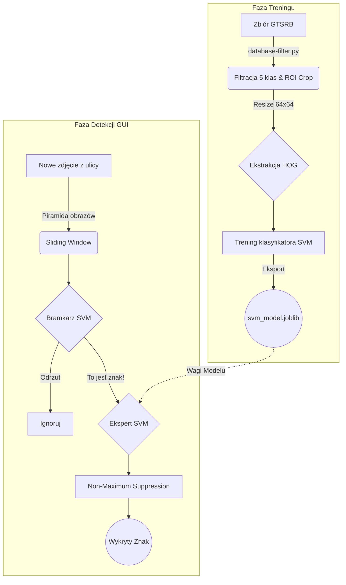

<div align="center">
  
# 🚦 System Wizyjny: Detekcja i Klasyfikacja Znaków Drogowych

[](https://www.python.org)
[](https://opencv.org)
[](https://scikit-learn.org/)
[]()

**Politechnika Rzeszowska im. Ignacego Łukasiewicza (PRz)**  
Projekt zaliczeniowy z przedmiotu **Wizja Komputerowa**

</div>

---

## 👥 Zespół Projektowy

| Imię i Nazwisko | Rola w projekcie |
| :--- | :--- |
| **Jakub Jaszcz** | Architektura, Klasyfikacja SVM, GUI |
| **Karol Malinowski** | Ekstrakcja cech (HOG), Ewaluacja modelu |
| **Jakub Śliwa** | Segmentacja MSER, Przetwarzanie obrazu |
| **Filip Konfederak** | Detekcja krawędzi (Canny), Analiza HSV |
| **Krystian Nowak** | Baza danych, Skrypty filtrujące, Testy |

---

## 🎯 Cel Projektu i Założenia

Celem naszego projektu jest praktyczne zastosowanie klasycznych metod wizji komputerowej do rozwiązania rzeczywistego problemu: **autonomicznego rozpoznawania znaków drogowych z poziomu pojazdu**. 

Dlaczego takie podejście? W dobie wszechobecnych, ciężkich sieci neuronowych (Deep Learning), chcieliśmy udowodnić i zbadać, jak dobrze radzą sobie **klasyczne techniki przetwarzania obrazu** (Canny, MSER, HOG) połączone z tradycyjnym uczeniem maszynowym (SVM). Dzięki temu nasz system jest:
- **Lekki** (nie wymaga GPU do działania),
- **Interpretowalny** (wiemy dokładnie, dlaczego znak został wykryty na podstawie jego krawędzi, koloru i gradientów),
- **Edukacyjny** (pozwala na dogłębne zrozumienie fundamentów Computer Vision).

---

## ⚙️ Architektura Systemu

Nasz potok przetwarzania (pipeline) dzieli się na fazę treningową oraz fazę inferencji (rozpoznawania na żywo przez GUI).



### Wybrane 5 klas znaków:
1. 🛑 **Znak STOP** (ID: 14)
2. ⛔ **Zakaz wjazdu** (ID: 17)
3. ⚠️ **Droga z pierwszeństwem** (ID: 12)
4. ⬆️ **Nakaz jazdy prosto** (ID: 35)
5. 🛞 **Ograniczenie prędkości 50 km/h** (ID: 2)

---

## 🛠️ Wykorzystane Technologie

- **Język:** Python 3.8+
- **Przetwarzanie obrazu:** OpenCV, NumPy, scikit-image
- **Ekstrakcja Cech:** HOG (Histogram of Oriented Gradients)
- **Uczenie Maszynowe:** scikit-learn (Support Vector Machine z jądrem liniowym)
- **GUI Desktopowe:** Tkinter, Pillow
- **Wizualizacja danych:** Matplotlib, Seaborn

---

## 🚀 Jak odpalić projekt u siebie?

### 1. Wymagania wstępne i instalacja

Sklonuj repozytorium i zainstaluj niezbędne biblioteki. Zalecamy użycie wirtualnego środowiska (`.venv`).

```bash
git clone https://github.com/xFluzr/detekcja_znakow_drogowych.git
cd traffic-signs-detection
pip install -r requirements.txt
```

> [!WARNING]
> Zanim przejdziesz dalej, upewnij się, że w głównym folderze znajduje się rozpakowany katalog `archive/` ze zbiorem danych **GTSRB** (pliki `Train.csv`, `Test.csv` oraz foldery z obrazami).

### 2. Przygotowanie danych (Preprocessing)
Ten skrypt wyciągnie z ogromnej bazy tylko nasze 5 klas, wytnie same znaki (ROI) i ujednolici rozmiar do 64x64 pikseli.
```bash
python database-filter.py
```
*(Utworzy to folder `processed_data/` z danymi gotowymi do nauki)*

### 3. Trening Modelu
Uruchom główny skrypt treningowy, który wygeneruje macierze pomyłek, raporty oraz plik modelu `svm_model.joblib`.
```bash
python svm_training_and_prediction.py
```

### 4. ODPALENIE APLIKACJI GUI 🖥️
Kiedy masz już wytrenowany model, możesz bawić się detekcją!
```bash
python gui.py
```
Otworzy się okienko. Wgraj własne zdjęcie (lub zdjęcia z folderu `testowe_znaki/`) i zobacz jak algorytm nakłada ramki na znalezione znaki!

---

## 🔬 Badania i Eksperymenty (Skrypt `experiments.py`)

Aby potwierdzić skuteczność naszych metod, zaimplementowaliśmy zautomatyzowany skrypt do eksperymentów:
```bash
python experiments.py
```
**Co on bada?**
1. **Porównanie Kerneli SVM:** Sprawdza, czy jądro `linear`, `rbf` czy `poly` radzi sobie najlepiej (pod kątem dokładności i czasu).
2. **Optymalizacja parametru C:** Bada wpływ siły regularyzacji (od 0.001 do 100).
3. **Konfiguracje deskryptora HOG:** Analizuje różne warianty `cell_size` oraz ilości binów histogramu i ich wpływ na skuteczność.
4. **Cross-Validation:** 5-krotna walidacja krzyżowa dla upewnienia się, że model nie jest "przeuczony" (overfitted).

Wszystkie wykresy i tabele CSV zapisywane są automatycznie do folderu `results/`.

---

## 📁 Struktura Repozytorium

```text
traffic-signs-detection/
├── archive/                        # Surowa baza GTSRB (musisz tu wypakować)
├── processed_data/                 # Wycięte znaki gotowe do analizy
├── results/                        # Wykresy i metryki z eksperymentów
├── testowe_znaki/                  # Zdjęcia z ulicy do testowania GUI
│
├── utils.py                        # Wspólne narzędzia (konfiguracja HOG)
├── database-filter.py              # Skrypt nr 1: Przygotowanie bazy
├── svm_training_and_prediction.py  # Skrypt nr 2: Trening SVM i macierze
├── experiments.py                  # Skrypt nr 3: Benchmarki i wykresy
├── visualize_hog.py                # Skrypt nr 4: Generuje wizualizację HOG
├── gui.py                          # Skrypt nr 5: Aplikacja desktopowa okienkowa
│
├── image-processing.py             # Badania segmentacji: Metoda krawędzi (Canny)
├── mser_image_processing.py        # Badania segmentacji: Metoda plam (MSER)
│
├── requirements.txt                # Lista wymaganych pakietów Python
└── README.md                       # Plik, który właśnie czytasz :)
```

---
<div align="center">
  <i>Zaprojektowano i zakodowano z pasją przez studentów PRz.</i>
</div>
