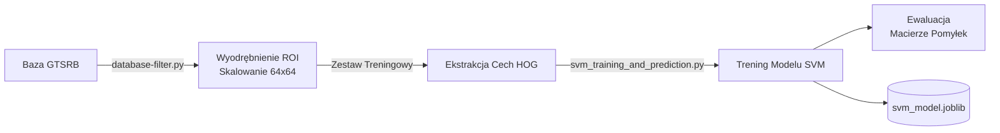
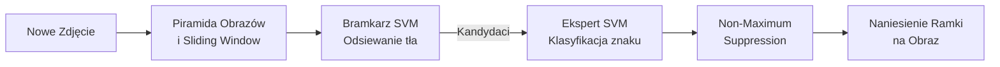

<div align="center">
  
# System Wizyjny: Detekcja i Klasyfikacja Znaków Drogowych

[](https://www.python.org)
[](https://opencv.org)
[](https://scikit-learn.org/)

**Politechnika Rzeszowska im. Ignacego Łukasiewicza (PRz)**  
Projekt zaliczeniowy z przedmiotu **Wizja Komputerowa**

</div>

---

## Zespół Projektowy

| Imię i Nazwisko | Rola w projekcie |
| :--- | :--- |
| **Jakub Jaszcz** | Architektura, Klasyfikacja SVM, GUI |
| **Karol Malinowski** | Ekstrakcja cech (HOG), Ewaluacja modelu |
| **Jakub Śliwa** | Segmentacja MSER, Przetwarzanie obrazu |
| **Filip Konfederak** | Detekcja krawędzi (Canny), Analiza HSV |
| **Krystian Nowak** | Baza danych, Skrypty filtrujące, Testy |

---

## Cel Projektu i Założenia

Celem naszego projektu jest praktyczne zastosowanie klasycznych metod wizji komputerowej do rozwiązania rzeczywistego problemu: **autonomicznego rozpoznawania znaków drogowych z poziomu pojazdu**. 

W przeciwieństwie do rozwiązań bazujących na głębokich sieciach neuronowych (Deep Learning), projekt ten w pełni polega na **klasycznych technikach przetwarzania obrazu** (Canny, MSER, przestrzenie barw) połączonych z tradycyjnym uczeniem maszynowym (SVM). Zapewnia to lekkość obliczeniową (brak konieczności użycia akceleratorów GPU) oraz wysoką interpretowalność uzyskiwanych wyników.

---

## Architektura Systemu

System składa się z dwóch niezależnych potoków: przygotowania i treningu modelu oraz detekcji w czasie rzeczywistym.

### 1. Potok Treningowy



### 2. Potok Detekcji (GUI)



### Rozpoznawane Klasy Znaków
Model został zoptymalizowany pod kątem 5 wybranych klas:
1. **Znak STOP** (ID: 14)
2. **Zakaz wjazdu** (ID: 17)
3. **Droga z pierwszeństwem** (ID: 12)
4. **Nakaz jazdy prosto** (ID: 35)
5. **Ograniczenie prędkości 50 km/h** (ID: 2)

---

## Wykorzystane Technologie

- **Język:** Python 3.8+
- **Przetwarzanie obrazu:** OpenCV, NumPy, scikit-image
- **Ekstrakcja Cech:** HOG (Histogram of Oriented Gradients)
- **Uczenie Maszynowe:** scikit-learn (Support Vector Machine z jądrem liniowym)
- **GUI Desktopowe:** Tkinter, Pillow
- **Wizualizacja danych:** Matplotlib, Seaborn

---

## Instrukcja Uruchomienia

### 1. Wymagania wstępne i instalacja

Pobierz repozytorium i zainstaluj niezbędne biblioteki. Zalecane jest użycie wirtualnego środowiska (`.venv`).

```bash
git clone https://github.com/xFluzr/detekcja_znakow_drogowych.git
cd traffic-signs-detection
pip install -r requirements.txt
```

> [!WARNING]
> Przed przystąpieniem do pracy, upewnij się, że w głównym katalogu znajduje się rozpakowany folder `archive/` ze zbiorem danych **GTSRB** (wymagane są pliki `Train.csv`, `Test.csv` oraz podkatalogi z obrazami).

### 2. Przygotowanie danych (Preprocessing)
Skrypt filtruje surową bazę danych, pozostawiając wyłącznie 5 wybranych klas. Dokonuje również wycięcia znaków (ROI) i normalizacji rozmiaru do 64x64 pikseli.
```bash
python database-filter.py
```
*(Zostanie utworzony katalog `processed_data/` zawierający znormalizowany zbiór treningowy i testowy).*

### 3. Trening Modelu
Główny skrypt odpowiadający za ekstrakcję cech HOG, proces uczenia klasyfikatora SVM oraz jego weryfikację.
```bash
python svm_training_and_prediction.py
```
*(Skrypt zapisuje gotowy model jako `svm_model.joblib` oraz generuje wykresy ewaluacyjne).*

### 4. Aplikacja Okienkowa (GUI)
Po zakończeniu procesu uczenia, możliwa jest detekcja znaków na dowolnych zdjęciach testowych.
```bash
python gui.py
```

---

## Badania i Eksperymenty

W celu potwierdzenia skuteczności zastosowanych metod oraz doboru optymalnych parametrów, przygotowano moduł badawczy:
```bash
python experiments.py
```

Moduł automatyzuje proces przeprowadzania eksperymentów:
1. **Analiza Kerneli SVM:** Porównanie wydajności jądra liniowego (`linear`), wielomianowego (`poly`) oraz RBF.
2. **Optymalizacja parametru C:** Badanie wpływu siły regularyzacji SVM na dokładność klasyfikacji.
3. **Konfiguracje deskryptora HOG:** Analiza wariantów rozmiaru komórki (`cell_size`) oraz liczby przedziałów histogramu (`nbins`).
4. **Cross-Validation:** 5-krotna walidacja krzyżowa dla modelu optymalnego.

Wszystkie wyniki (tabele CSV oraz wykresy w formacie PNG) są automatycznie zapisywane w podkatalogu `results/`.

---

## Struktura Repozytorium

```text
traffic-signs-detection/
├── archive/                        # Surowa baza GTSRB (wymaga ręcznego wypakowania)
├── processed_data/                 # Przetworzone i znormalizowane dane treningowe/testowe
├── results/                        # Wygenerowane wykresy i metryki z badań
├── testowe_znaki/                  # Zdjęcia z przestrzeni miejskiej do testów GUI
│
├── utils.py                        # Moduł pomocniczy (konfiguracja HOG, stałe)
├── database-filter.py              # Skrypt nr 1: Preprocessing bazy danych
├── svm_training_and_prediction.py  # Skrypt nr 2: Uczenie i ewaluacja SVM
├── experiments.py                  # Skrypt nr 3: Zautomatyzowane eksperymenty
├── visualize_hog.py                # Skrypt nr 4: Wizualizacja wektorów HOG
├── gui.py                          # Skrypt nr 5: Aplikacja GUI z modułem sliding window
│
├── image-processing.py             # Alternatywne badania segmentacji (Canny)
├── mser_image_processing.py        # Alternatywne badania segmentacji (MSER)
│
├── requirements.txt                # Zależności projektowe środowiska Python
└── README.md                       # Dokumentacja główna projektu
```

---
<div align="center">
  <i>Zaprojektowano i zaimplementowano przez studentów Politechniki Rzeszowskiej.</i>
</div>
